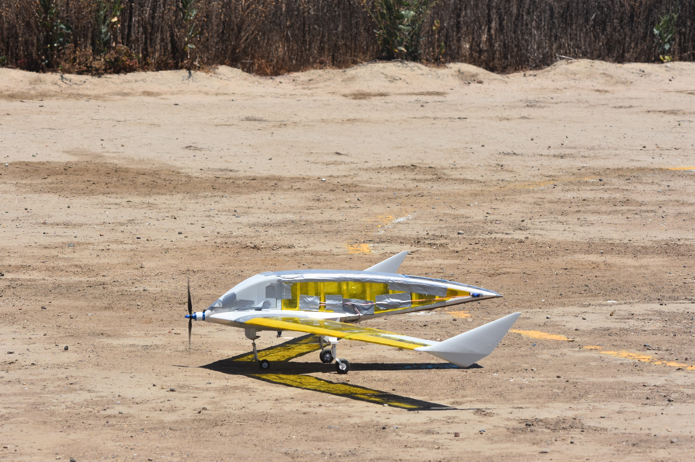

<div align="center">

# NIMBUS

**UC San Diego · MAE 155B Aircraft Design · Spring 2026**

RC fixed-wing aircraft designed and optimized from scratch for a package delivery competition profit function.


<br>


<br>

 

</div>

---

## Overview

Nimbus is a swept flying-wing RC aircraft built around an end-to-end MATLAB analysis pipeline. The design is driven by a CMA-ES global optimizer that maximizes a competition profit score — trading off payload volume, cruise efficiency, structural weight, and aerodynamic performance. All subsystems (aerodynamics, propulsion, stability, structure, economics) are modeled from scratch and tightly coupled.

The aircraft was manufactured by the team and completed flight testing at Mission Bay Park, San Diego, in Spring 2026.

---

## Aircraft Specifications

### Geometry

| Parameter | Value |
|---|---|
| Configuration | Swept flying wing + twin vertical fins |
| Full span | **1.5715 m** (61.9 in) |
| Wing reference area | **0.3087 m²** |
| Aspect ratio | **8.0** |
| Taper ratio | 0.661 |
| Quarter-chord sweep | **28.3°** |
| Root chord | 0.2365 m (9.3 in) |
| Tip chord | 0.1563 m (6.2 in) |
| Mean aerodynamic chord | 0.1992 m (7.8 in) |
| Fuselage length | 0.95 m |
| Root airfoil | Eppler 222 |
| Tip airfoil | Eppler 230 |
| Vertical fin airfoil | NACA 0010 (twin, 65° sweep) |
| Elevon chord fraction | 45% local chord, outboard |
| Geometric washout | −4.04° tip (Panknin method) |

### Weights & Loading

| Parameter | Value |
|---|---|
| Gross weight (loaded) | **2.90 kg** |
| Empty weight | ~2.10 kg |
| Payload | **800 g** |
| Wing loading | 71.5 N/m² |

### Performance

| Parameter | Value |
|---|---|
| Design cruise speed | **20 m/s** (44.7 mph) |
| Stall speed (loaded) | 12.0 m/s (26.8 mph) |
| Cruise L/D | **14.34** |
| Cruise alpha | 2.46° |
| Static thrust | 17.77 N |
| Propeller | APC 10×4.7SF |
| Motor KV | 1100 RPM/V |
| Battery | 3S LiPo, 11.1 V |
| Max current draw | 33.1 A (limit 35 A) |
| Competition profit score | **$10.73 / hr** |

### Stability

| Mode | Result | Rating |
|---|---|---|
| Static margin (loaded) | **11.4% MAC** | ✅ In band (10–20%) |
| Short period | ζ = 0.456, ωₙ = 9.49 rad/s | ✅ Level 1 |
| Phugoid | ζ = −0.033 | ⚠️ Mildly unstable |
| Dutch roll | ζ = 0.092, ωₙ = 5.23 rad/s | Level 2 |
| Roll subsidence | τ = 0.042 s | ✅ Level 1 |
| Spiral | t₂ = 20.9 s | ✅ Level 1 |
| Trim elevon deflection | 4.96° trailing-edge down | ✅ Well within ±20° |

### Structure

| Parameter | Value |
|---|---|
| Spar material | Carbon fiber tube |
| Selected spar diameter | 10 mm |
| Required minimum diameter | 8.0 mm |
| Root bending moment (3.8g) | 5.05 N·m |
| Bending factor of safety | **3.89** |
| Max tip deflection | 60.5 mm (3.9% semispan) |
| Elevon servo load (one side) | 63% of SG90 capacity |

---

## CAD Model

<div align="center">


<br>

 

</div>

---

## Internal Design

<div align="center">


<br>

 

<br>


*Cargo door rail and actuation mechanism*

</div>

📐 **[Technical Drawing — Nimbus V3 (PDF)](assets/images/Nimbus%20V3%20Drawings.pdf)**

---

## Flight Day

<div align="center">


<br>

  

 

</div>

---

## Team

<div align="center">


**Harshil Patel · John Sigafoos · Angel Ochoa · Juan Sanchez · Sara Chowdhury · Analisa Veloz**

*Group 2 — MAE 155B Aircraft Design, UC San Diego, Spring 2026*

</div>

---

## Analysis Plots

*Run `export_plots.m` to auto-generate all figures below into `assets/plots/`.*

### 3D Aircraft Geometry

<div align="center">

</div>

---

### CTOL Constraint Diagram

<div align="center">

</div>

Design point: W/S = 71.5 N/m², T/W = 0.474, governed by the takeoff constraint. Available T/W at climb speed = 0.54 (14% margin).

---

### V-n Diagram — Maneuver and Gust Envelope

<div align="center">

</div>

| | Value |
|---|---|
| Positive limit load factor | +3.8 g |
| Negative limit load factor | −1.5 g |
| Maneuver speed Vₐ | 24.1 m/s |
| Gust delta-n at Vc (9.1 m/s gust) | ±4.8 g |

---

### Airfoil Polars — Root (E222) and Tip (E230)

<div align="center">
 
</div>

Evaluated via XFOIL surrogate at Re_root = 3.15×10⁵, Re_tip = 2.08×10⁵.

---

### Aircraft Polar — Lift Curve and Drag Polar

<div align="center">
 
</div>

---

### Drag Build-Up

<div align="center">

</div>

---

### Spanwise Lift and Twist

<div align="center">
 
</div>

---

### Mission Profile

<div align="center">


</div>

---

### Propulsion — APC 10×4.7SF

<div align="center">
 
</div>

---

### Profit Score vs. Payload Weight

<div align="center">

</div>

Optimal payload: 1200 g (J = $12.53/hr, SM = 13.9%). Design carries 800 g (J = $10.73/hr) to keep stall speed ≤12 m/s within the runway constraint.

---

## Analysis Pipeline

`main.m` runs every module in sequence:

| Module | Description |
|---|---|
| Weight sizing | Empty-weight fraction model with payload volume penalty |
| Mission energy | Climb + cruise + reserve from L/D and propulsive efficiency |
| Profit score | Competition J(x) — first-pass and physics-corrected |
| Mission profile | Lap geometry, runway, climb/descent distances |
| Propulsion | Thrust curve from motor KV + APC propeller surrogate |
| CTOL sizing | Constraint diagram: wing loading vs. thrust-to-weight |
| Wing geometry | Span, root/tip chord, MAC, elevon coordinates |
| Airfoil analysis | XFOIL surrogate database — interpolated at cruise Re |
| Twist distribution | Panknin method for spanwise washout |
| Vertical surfaces | Twin delta fin geometry and sizing |
| Drag polar | Raymer-style CD₀ build-up — wing, body, fins |
| Spanwise aero | Lift distribution across the span |
| Mass properties | Component-level CG and inertia tensor (CAD-imported) |
| Static stability | Neutral point and static margin (% MAC) |
| V-n diagram | Maneuver and gust load envelope |
| Dynamic stability | AVL eigenvalue analysis — short period, phugoid, Dutch roll, roll, spiral |
| Control surfaces | Trim deflection, max load factor, hinge moments, turn radius |
| Structure sizing | Spar bending, deflection, shear, landing impact |
| Monte Carlo | Profit sensitivity to design variable uncertainty |
| Profit optimizer | Full CMA-ES aircraft optimizer |

---

## Code Structure

```
MAE155B-Aircraft-Design/
├── main.m                    ← Entry point
├── run_project.m             ← Adds src/ to MATLAB path (run first)
├── export_plots.m            ← Saves all figures to assets/plots/
│
├── src/
│   ├── aerodynamics/         ← Airfoil surrogates, drag polar, spanwise aero, twist
│   ├── geometry/             ← Wing, winglet, fuselage geometry
│   ├── Stability/            ← Static/dynamic stability, CG, AVL interface
│   ├── propulsion/           ← Motor + propeller analysis and surrogate models
│   ├── energy/               ← Energy and battery sizing
│   ├── mission/              ← Flight performance and lap geometry
│   └── economics/            ← Profit function and CMA-ES optimizer
│
├── plotting/                 ← Visualization functions
├── data/
│   ├── airfoils/             ← Airfoil .dat files (XFOIL format)
│   ├── models/               ← Precomputed XFOIL surrogate database (.mat)
│   └── propellers/           ← APC propeller performance tables
│
├── AVL/Nimbus/               ← AVL executable + auto-generated geometry files
├── CFD/                      ← CFD surface model (.step, Fluent files)
├── assets/
│   ├── images/               ← Flight photos and CAD renders
│   └── plots/                ← MATLAB-generated figures (via export_plots.m)
└── outputs/                  ← Generated results (gitignored)
```

---

## How to Run

```matlab
% Set MATLAB working directory to repo root, then:
run_project   % adds src/ to path
main          % executes full analysis pipeline (~30 s)
```

Run flags at the top of `main.m` toggle optional long-running sections:

```matlab
showPlots       = true;    % show all figures
runProfitOpt    = false;   % CMA-ES aircraft optimizer  (~6–10 hrs)
runMonteCarlo   = false;   % profit sensitivity analysis (~30 s)
runCSopt        = false;   % control surface optimizer
runSweep        = false;   % dynamic stability parameter sweep
```

Export all plots for this portfolio page:

```
matlab -batch "run('run_project.m'); run('export_plots.m')"
```
